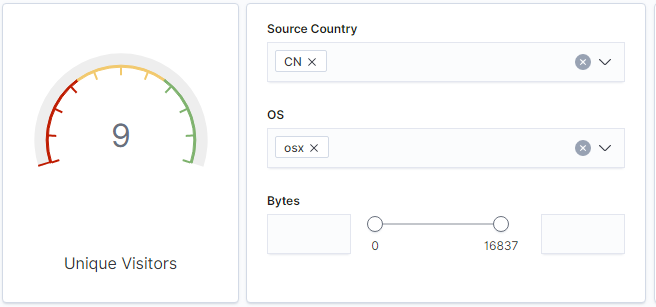
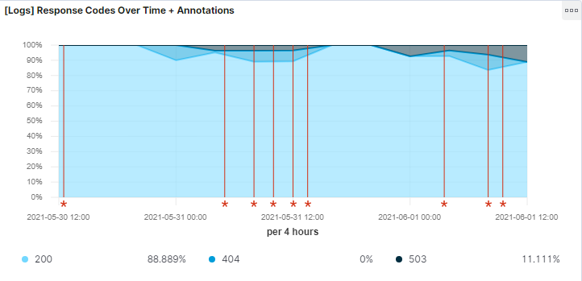
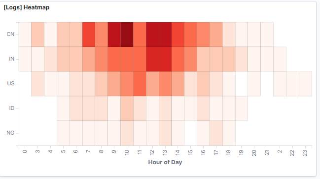
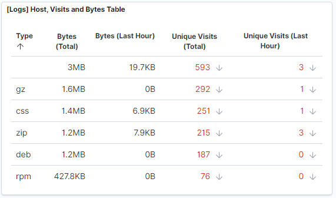
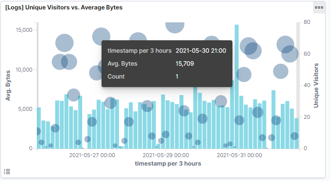
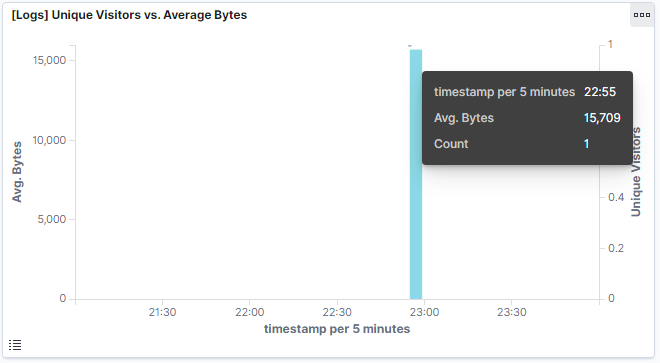
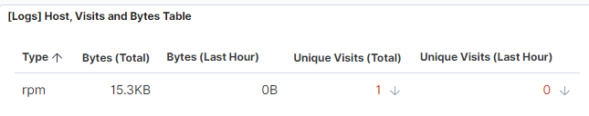
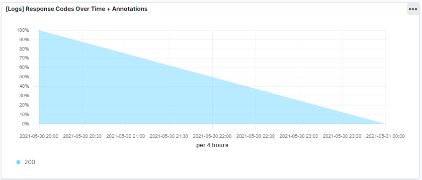
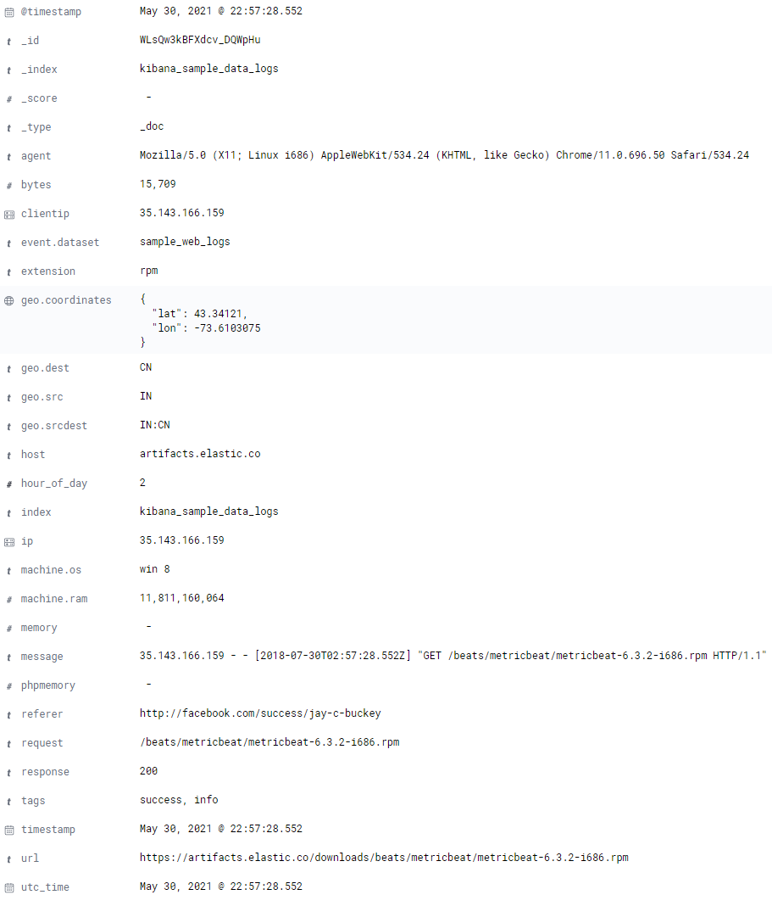

Exploring Kibana Activity:

Answer the following questions:

- In the last 7 days, how many unique visitors were located in India?
  Answer: There were 227 unique visitors from India.

- In the last 24 hours, of the visitors from China, how many were using Mac OSX?
  Answer: The were 14 visitors using Mac OSX.

- In the last 2 days, what percentage of visitors received 404 errors? How about 503 errors?
  Answer: 0% of visitors received a 404 error while 11.111% received 503 errors.

- In the last 7 days, what country produced the majority of the traffic on the website?
  Answer: China

- Of the traffic that's coming from that country, what time of day had the highest amount of activity?
  Answer: Between 9am and 10am and 12pm and 1pm.
 

- List all the types of downloaded files that have been identified for the last 7 days, along with a short description of each file     
  type.
  Answer: 
          - gz: .gz files are compressed files that were created using the gzip compression tool.
          - css: .css files define font, size, color, spacing, border and the location of HTML text on a webpage.
          - zip: .zip files are a lossless compression format that may contain one or more files or directories.
          - deb: a .deb file is a Debian Software Package used in Linux.
          - rpm: a .rpm file stands for Red Hat Package Manager and it is a Red Hat Software Package file.

- Locate the time frame in the last 7 days with the most amount of bytes (activity).
  Answer: 1 user is using an alarmingly high amount of bytes compared to other users.

- Filter the data by this event. What is the timestamp for this event?
  Answer: The time filter shows May 30, 2021 @21:00:00.0 -> May 31, 2021 @ 00:00:00.0. The timestamp is 22:55.

- What kind of file was downloaded?
  Answer: An RPM file.

- From what country did this activity originate?
  Answer: India.

- What HTTP response codes were encountered by this visitor?
  Answer: 200 OK

- What is the source IP address of this activity?
  Answer: 35.143.166.159

- What are the geo coordinates of this activity?
  Answer: { "lat": 43.34121, "lon": -73.6103075 }

- What OS was the source machine running?
  Answer: Windows 8

!

- What do you think the user was doing?
  Answer: The user downloaded a Linux package.

- Was the file they downloaded malicious? If not, what is the file used for?
  Answer: It could be anything from a harmless update package to a malicious file as it is a Linux package which is an           installation file.

- Was there anything that seems suspicious about this activity?
  Answer: The fact that its a referral link from Facebook raises flags as social networks are usually blocked by 
          corporate VPN's due to the overabundance of malicious files that can be accidently downloaded through the
          site.

- Is any of the traffic you inspected potentially outside of compliance guidelines?
  Answer: Downloading installation packages as well as following a referral link from Facebook should be addressed. The            user should be investigated further and educated on the dangers of malicious software.